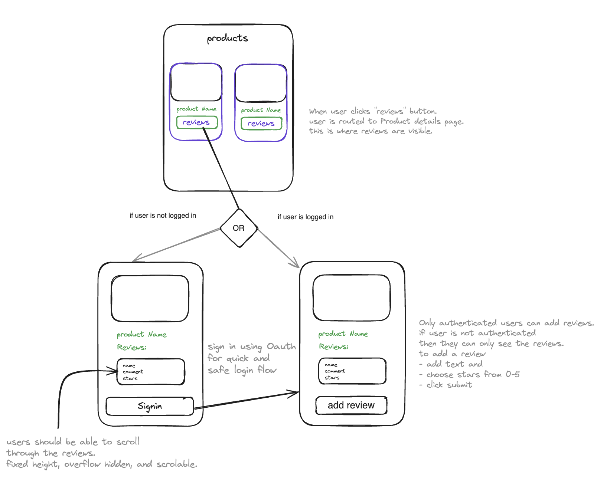

# E-commerce Product Reviews App

The E-commerce Product Reviews App is a web application that allows users to review and rate products in an e-commerce store. It provides a platform for customers to share their experiences and opinions about the products they have purchased.

due to lack of clarity on what the UX should look like I have created a wireframe above my own understanding. This should be hashed out further in collaboration with the stakeholders.

## Functional Requirements

- User registration and authentication
- View Product listings
- Product review submission and rating

## Non-functional Requirements
- React query - caching
- GraphQLRequest - formatting
- SSR - so products are indexed by Google for search (if this was a real application)
- Simplest and quickest way to implement authentication is by using next-auth (github)

## DB Schema -> src/schema/products.ts
in the below schema using name and id both seems redundant. I have only added ID due to best practices.

product {
    "id": String, 
    "name": String,
    "description": String,
    "price": Integer,
    "reviews": Review[]
}

Review {
    "id": String,
    "text": String,
    "rating": Integer,
    "userName": String
}

## Query Operations

Once the application is up and running, you can access it in your web browser at `http://localhost:3000`. From there, you can explore the product listings, read and submit reviews, and interact with other users.

## Creating a new query:
1. create resolver in products.resolver.js
2. create new graphQl file under graphQl folder and create a query
3. In the terminal execute '''npm run generate'''
4. Find the api.ts file make sure to import your new method from GraphQlClient

## Installation

To install and run the E-commerce Product Reviews App, follow these steps:

1. Clone the repository: `git clone https://github.com/your-username/e-commerce-reviews-app.git`
2. Install the dependencies: `npm install`
3. Run the application: `npm run dev`

## Next Steps:
Write Unit Tests to fetch all products, getProductById and addReviews to a product.
Implement Authentication using github.

## License
env.test.local
This project is licensed under the [MIT License](./LICENSE).