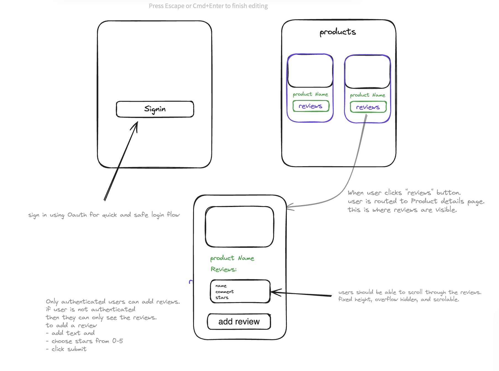

# E-commerce Product Reviews App

The E-commerce Product Reviews App is a web application that allows users to review and rate products in an e-commerce store. It provides a platform for customers to share their experiences and opinions about the products they have purchased.

## Features

- User registration and authentication
- View Product listings
- Product review submission and rating

## Installation

To install and run the E-commerce Product Reviews App, follow these steps:

1. Clone the repository: `git clone https://github.com/your-username/e-commerce-reviews-app.git`
2. Install the dependencies: `npm install`
3. Configure the database connection in the `.env` file
4. Run the application: `npm run dev`

## Usage

Once the application is up and running, you can access it in your web browser at `http://localhost:3000`. From there, you can explore the product listings, read and submit reviews, and interact with other users.

## Contributing

If you would like to contribute to the development of the E-commerce Product Reviews App, please follow the guidelines in the [CONTRIBUTING.md](./CONTRIBUTING.md) file.

## License

This project is licensed under the [MIT License](./LICENSE).